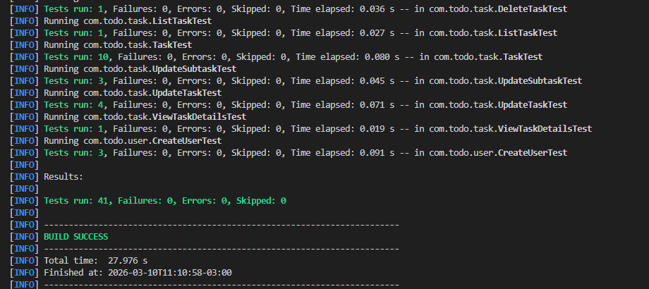

# Todo API

API de gerenciamento de tarefas desenvolvida em **Java com Spring Boot** com o objetivo de praticar conceitos de arquitetura, modelagem de domínio e testes unitários.

O projeto foi construído explorando organização baseada em **Use Cases**, **Aggregate Root** e separação de responsabilidades utilizando **ports and adapters**.

---

# Tecnologias utilizadas

- Java
- Spring Boot
- Spring Security
- JWT Authentication
- PostgreSQL
- Docker
- JUnit

---

# Arquitetura do projeto

O projeto segue uma separação de responsabilidades inspirada em **Arquitetura Hexagonal (Ports and Adapters)**.

Fluxo simplificado:

Controller  
↓  
Use Case (Application Layer)  
↓  
Ports (Interfaces)  
↓  
Repository (Infrastructure)  
↓  
Database

Estrutura de pastas:

src  
 ├── application  
 │ ├── usecases  
 │ └── ports  
 │  
 ├── domain  
 │ └── entities  
 │  
 ├── infrastructure  
 │ ├── repositories  
 │ └── configs  
 │  
 └── config

---

# Rodando o projeto

## 1 - Subir banco de dados

O projeto utiliza **Docker** para criar os bancos PostgreSQL.

Execute:

```bash
docker-compose up -d
```

Isso criará três bancos:

| Ambiente   | Porta |
| ---------- | ----- |
| develop    | 5432  |
| test       | 5433  |
| production | 5434  |

---

# Configuração da aplicação

A aplicação possui valores padrão no `application.properties`, portanto pode ser executada sem configuração adicional.

Caso deseje customizar o ambiente, as seguintes variáveis podem ser utilizadas:

Exemplo:

```
APP_JWT_SECRET=123
APP_JWT_ISSUER=todo

APP_GLOBAL_USER_EMAIL=admin@email.com
APP_GLOBAL_USER_PASSWORD=123456

DB_HOST=localhost
DB_PORT=5432
DB_NAME=todo-develop
DB_USERNAME=root
DB_PASSWORD=root
```

---

# Rodando a aplicação

A aplicação pode ser executada pela classe principal:

```
com.todo.TodoApplication
```

Caso utilize **VSCode**, pode criar uma versão para execução em:

```
.vscode/launch.json
```

e dentro fazer a configuração de exemplo:

```
{
  "configurations": [
    {
      "type": "java",
      "name": "dev",
      "mainClass": "com.todo.TodoApplication",
      "request": "launch",
      "env": {
        "APP_JWT_SECRET": "123",
        "APP_JWT_ISSUER": "todo",
        "APP_GLOBAL_USER_EMAIL": "admin@gmail.com",
        "APP_GLOBAL_USER_PASSWORD": "123456",
        "DB_NAME": "todo-develop",
        "DB_HOST": "localhost",
        "DB_PORT": "5432",
        "DB_USERNAME": "root",
        "DB_PASSWORD": "root"
      }
    }
  ]
}
```

---

# Usuário global para testes

Ao iniciar a aplicação, um **usuário global pode ser criado automaticamente** para facilitar testes da API.

A criação ocorre através da classe:

```
GlobalUserConfig
```

Se as variáveis abaixo estiverem definidas:

```
APP_GLOBAL_USER_EMAIL
APP_GLOBAL_USER_PASSWORD
```

A aplicação irá:

1. Verificar se o usuário já existe
2. Caso não exista, criar automaticamente no banco

---

# Autenticação

A API utiliza **JWT** para autenticação.

Após autenticar, o token deve ser enviado no header das requisições:

```
Authorization: Bearer {token}
```

---

# Endpoints principais

Exemplo de endpoints da API:

```
POST /auth/login
POST /tasks
GET /tasks
GET /tasks/{id}
PUT /tasks/{id}
DELETE /tasks/{id}
```

---

# Testes

O projeto possui **testes unitários focados na camada de Use Cases**, garantindo que as regras de negócio sejam validadas independentemente da infraestrutura.

---

# Demonstração

O repositório inclui:

- Print da execução dos testes



---

# Objetivo do projeto

Este projeto foi desenvolvido com foco em prática de:

- Arquitetura de APIs
- Separação de responsabilidades
- Modelagem de domínio
- Testes unitários
- Integração com banco de dados
- Autenticação com JWT

---

# Autor

Urias Luis Pereira

- LinkedIn: https://www.linkedin.com/in/urias-luis/
- GitHub: https://github.com/Urias01
